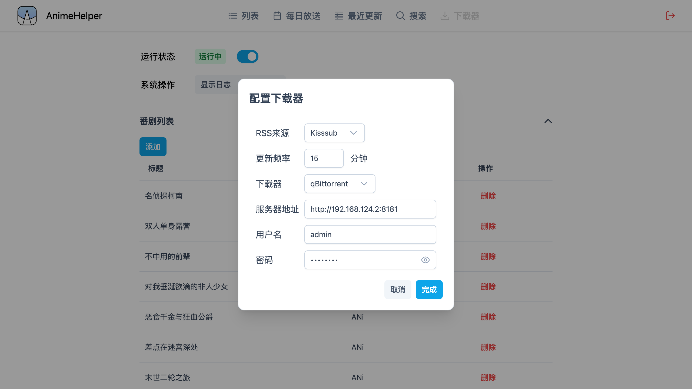

# Anime Helper

</img>


这个项目由ElysiaJS和Vue开发

前端页面的仓库[在这里](https://github.com/Zhoucheng133/Anime-Helper-UI)

## 目录
- [功能](#功能)
- [截图](#截图)
- [快速开始](#快速开始)
  - [部署](#部署)
  - [更新](#更新)
- [手动部署](#手动部署)
- [下载器配置](#下载器配置)
- [一些API](#一些api)

## 功能

### 列表
- 手动添加已完结的番剧，并且可以编辑观看进度
- 手动添加更新中的番剧，你需要添加更新周和已更新的集数，自动计算已经更新的集数
- 你也可以从`每日放送`页面中自动添加更新中的番剧
- 筛选番剧列表，分类方式有`所有`, `进行中`(没看完的), `更新中`, `已完结`, `已看完`, `搜索`和`更新周`

### 每日放送
- 通过Bangumi API获取每周更新的番剧
- 点击番剧可以自动添加到`列表`中

### 最近更新
- 显示最近更新的番剧（你可以选择来源是`蜜柑计划`或者`Kisssub`）
- 复制磁力链接或者种子链接
- 自动添加到`下载器`的番剧列表中
- 直接下载 **(需要配置下载器)**

### 搜索
- 搜索番剧 (受限于Kisssub的RSS限制，显示的结果不一定完整)
- 和`最近更新`一样，你可以复制磁力链接或者种子链接、添加到`下载器`的番剧列表中或者直接下载

### 下载器
- 将正在更新的番剧添加到番剧列表中（需要你填写字幕组和番剧名称），监听`蜜柑计划`、`Kisssub`或`Acgrip`的RSS列表，匹配的会自动下载
- 支持`Aria2`和`qBitorrent`下载器
- 支持自定义更新频率（为保护RSS服务，最低频率为10分钟）
- 支持添加排除关键字（比如遇到`720P`关键词不会下载）

## 截图




## 快速开始

### 部署

本项目需要使用Docker进行配置

> [!NOTE]
> 你需要修改下面命令中带有尖括号的内容（包括尖括号本身）

```bash
sudo docker run -d \
--restart always \
--name anime-helper \
-p <主机端口>:3000 \
-v <主机上存储数据库的位置*>:/app/db \
zhouc1230/anime-helper:latest
```

*任意，保证存在并且可以读写的目录即可

> [!IMPORTANT]
> 如果你使用Kisssub作为RSS源，会自动将获取到的列表翻译成简体中文，因此请以`最近更新`或者`搜索`页面的结果为准

### 更新

```bash
# 拉取最新镜像
docker pull zhouc1230/anime-helper:latest
# 停止旧容器
docker stop anime-helper
# 删除旧容器
docker rm anime-helper
# 启动新容器
sudo docker run -d \
--restart always \
--name anime-helper \
-p <主机端口>:3000 \
-v <主机上存储数据库的位置>:/app/db \
zhouc1230/anime-helper:latest
```

## 手动部署

1. 下载源代码到你的服务器上
2. 使用命令生成镜像`sudo docker build -t helper <文件夹目录>`
3. 使用下面的命令生成容器

```bash
sudo docker run -d \
--restart always \
-p <主机端口>:3000 \
-v <主机上存储数据库的位置>:/app/db \
--name helper helper
```
若要在Docker上部署，文件结构应该是这样
```
📁 项目根目录/
├── 📄 bun.lockb
├── 📄 Dockerfile
├── 📄 package.json
├── 📄 tsconfig.json
├── 📁 src/
│   ├── 📄 index.ts
│   └── 📁 routes/
│       └── ...其他文件
├── 📁 public/
│   ├── 📄 icon.svg
│   ├── 📄 index.html
│   └── 📁 assets/
│       └── ...其他文件
```

## 下载器配置

## 在Docker上部署Aria服务

你需要在搭建设备局域网内（或者就在该设备上）有Aria2服务，详细你可以[查看这里](https://github.com/P3TERX/Aria2-Pro-Docker)。如果你通过该文档安装了Aria2，那么默认的Aria2地址为`http://<ip>:16800/jsonrpc`，密码在你通过Docker安装的时候作为参数写入

## 在Docker上部署qBitorrent服务
你可以在Docker上部署qBitorrent服务，详细你可以[查看这里](https://hub.docker.com/r/linuxserver/qbittorrent)

## 使用Motrix下载器 (不推荐)
你也可以通过[Motrix](https://motrix.app/zh-CN)作为Aria下载器，其下载端口和密码在该软件的设置中

## 一些API

[Bangumi API](https://bangumi.github.io/api/)

[Mikan RSS](https://mikanime.tv/RSS/Classic)

[Kisssub RSS](https://kisssub.org/rss.xml)