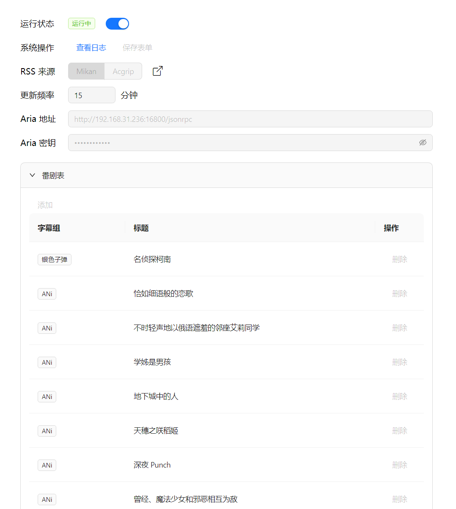

# Anime Helper


  


用于从[Acgrip](https://acgrip.art/)或者[Mikan Project](https://mikanime.tv/)自动化下载番剧的项目

这是[Mikan Helper](https://github.com/Zhoucheng133/Mikan-Helper)的一个分支，添加对`acgrip`的rss订阅链接的支持，[Mikan Helper](https://github.com/Zhoucheng133/Mikan-Helper)已不再维护

**在使用本项目前务必阅读[使用说明](#使用说明)**

## 截图



## 使用说明

提供两种方法：[直接搭建](#直接搭建)和[在Docker上搭建](#在docker上搭建)，你可以根据自己的需求搭建本服务。**建议**使用Docker搭建本服务

建议在服务器上搭建（比如树莓派 / NAS等）

### 使用前准备

在你需要搭建的设备上安装`Node.js`**18或者更高的版本**

你需要在搭建设备局域网内（或者就在该设备上）有Aria2服务，详细你可以[查看这里](https://github.com/P3TERX/Aria2-Pro-Docker)。如果你通过该文档安装了Aria2，那么默认的Aria2地址为`http://<ip>:16800/jsonrpc`，密码在你通过Docker安装的时候作为参数写入

下载本项目所有文件( Code->Download ZIP )

### 直接搭建

执行下面的命令搭建服务：
```bash
cd <本项目目录>
npm install pm2 -g
npm install
pm2 start main.js
```
如果要停止服务：
```bash
pm2 stop main.js
```

Web端入口为端口`8811`

### 在Docker上搭建

本项目已经创建好了`dockerfile`，你可以直接通过它来在Docker上搭建本服务

```bash
cd <本项目目录>
sudo docker build -t anime_helper .
sudo docker run -d --restart always -p 8811:8811 --name anime_helper <镜像id>
```

### 启动服务

你需要填写以下信息才能启动服务：
- RSS来源：单选，Mikan或者Acgrip*，默认为Mikan
- 更新频率：一个数字，表示服务每隔多久会检查一次rss内容，默认为15分钟，最少为10分钟，最多为1440分钟（一天）
- Aria 地址：参考[使用前准备](#使用前准备)
- Aria 密钥：参考[使用前准备](#使用前准备)
- 番剧表：这是一个表格，你**需要**添加一些番剧，这些番剧有两部分组成：字幕组和标题，检查rss内容时会匹配标题同时含有字幕组和标题
- 排除关键字：这是一个表格，你**可以**添加一些如果出现这些关键字不会加入到下载队列

\* 注意，Acgrip和Mikan的番剧表标题并不一定相同（尤其是一些繁体语言发布内容），因此并不互通，如果你需要修改RSS来源，也务必要修改番剧表内容

## 注意事项

- 本项目rss接口来自[Acgrip](https://acgrip.art/.xml)和[蜜柑计划](https://mikanime.tv/RSS/Classic)，不要滥用接口