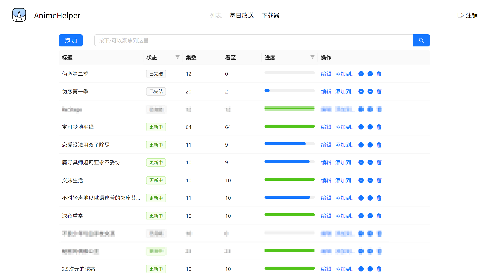
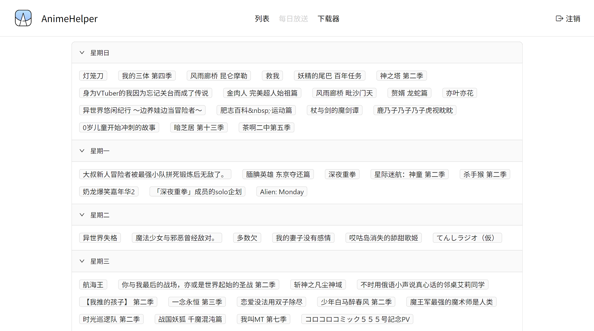
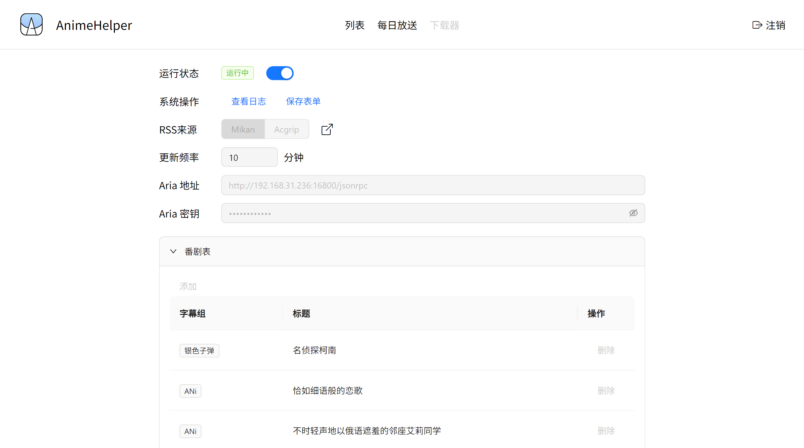

# Anime Helper

</img>


一个追番&自动下载工具，如需在本地搭建，务必先阅读[使用说明](#使用说明)

前端页面[在这里](https://github.com/Zhoucheng133/Anime-Helper-Web)

## 截图

### 列表

查看目前观看进度，根据总集数&更新集数自动推断是否在更新/完结  
也可以在这里添加到下载器列表



### 每日放送

可以点击标题来添加到列表中



### 下载器

这里会通过Mikan或者Acgrip自动下载需要下载的番剧（注意，你需要在这个页面手动添加需要下载的番剧&字幕组信息或者在列表页添加到这里）



## 使用说明

### 本地搭建 (不推荐)

1. 你需要在你的设备上安装[bun](https://bun.sh/)，如果你的设备上已经安装了`Node.js`，你也可以通过下面的命令安装:
    ```bash
    npm install bun -g
    ```
2. 你需要从Release页中下载生产用的zip压缩包`build.zip`，当然你也可以下载源代码然后通过下面的命令生成index.js，并且复制源代码中的web文件夹（详细的前端页面代码[在这里](https://github.com/Zhoucheng133/Anime-Helper-Web)）
   ```bash
   # 这个命令会导出生产用的js到build文件夹
   bun build src/index.ts --target=node --outdir ./build
   ```
3. 生产用的文件应该长这样
   ```bash
   index.js
   db # 这是一个空文件夹，必须要有!
   dockerfile # 在本地搭建中可以忽略这个文件
   web
    - index.html
    - icon.svg
    - assets
      - #其它内容
   ```
4. 使用下面的命令来运行
   ```bash
   cd <生产目录>
   bun run index.js
   ```

### 使用Docker搭建

1. 你需要从Release页中下载生产用的zip压缩包`build.zip`，当然你也可以下载源代码然后通过下面的命令生成index.js，并且复制源代码中的web文件夹（详细的前端页面代码[在这里](https://github.com/Zhoucheng133/Anime-Helper-Web)）
   ```bash
   # 这个命令会导出生产用的js到build文件夹
   bun build src/index.ts --target=node --outdir ./build
   ```
2. 生产用的文件应该长这样，**注意，如果你希望和主机共享数据内容，请删除db这个空文件夹，否则务必保留**
   ```bash
   index.js
   db # 空文件夹，如果要与主机共享数据请删除
   dockerfile
   web
    - index.html
    - icon.svg
    - assets
      - #其它内容
   ```
3. 使用下面的命令生成镜像（可能有的系统需要使用sudo权限运行命令）
   ```bash
   cd <生产目录>
   docker build -t anime-helper .
   ```
   并且通过这个命令找到镜像id
   ```bash
   docker image ls
   ```
4. 通过下面的命令创建容器（不需要共享数据内容）
   ```bash
   sudo docker run -d --restart always -p <主机的端口号>:3000 --name helper <镜像id>
   ```
   如果你想要和主机共享数据内容，使用下面的命令
   ```bash
   sudo docker run -d --restart always -p <主机的端口号>:3000 -v <主机的路径>:/app/db --name helper <镜像id>
   ```

### 下载器配置

#### 在Docker上部署Aria服务

你需要在搭建设备局域网内（或者就在该设备上）有Aria2服务，详细你可以[查看这里](https://github.com/P3TERX/Aria2-Pro-Docker)。如果你通过该文档安装了Aria2，那么默认的Aria2地址为`http://<ip>:16800/jsonrpc`，密码在你通过Docker安装的时候作为参数写入

#### 使用Motrix下载器 (不推荐)
你也可以通过[Motrix](https://motrix.app/zh-CN)作为Aria下载器，其下载端口和密码在该软件的设置中