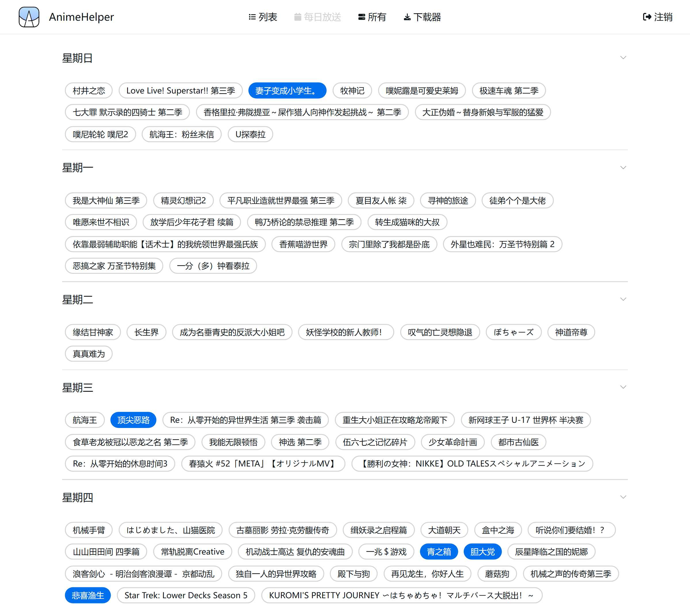
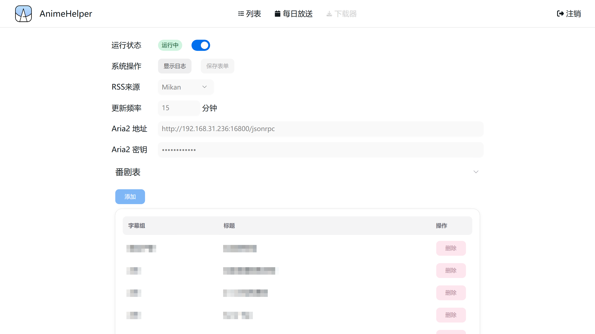

# Anime Helper

</img>

一个追番&自动下载工具，如需在本地搭建，务必先阅读[部署](#部署)

这个项目由ElysiaJS和Next.js开发

## 截图

## 部署

### 基础服务

不推荐直接将本服务部署在本地机器上，下面的部署方法需要使用Docker

#### 【方法一】在本地Build（适用于服务器性能较弱的情况）
- 需要安装`bun`环境，你可以[在这里](https://bun.sh/)查看如何在你的设备上安装
- 使用命令安装依赖：`bun install`
- 使用命令生成生产文件：`bun run build`
- 删除`dockerfile`中的`RUN bun run build`这行
- 将所有文件和目录（**除去**`node_modules`，**包含**`.next`）拷贝到服务器
- 使用docker生成镜像`sudo docker build -t helper <拷贝到服务器的路径>`
- 使用docker生成容器`sudo docker run -d --restart always -p <主机端口*>:3000 -v <配置目录**>:/app/db --name helper helper`

#### 【方法二】直接在服务器端部署
- 将本项目代码复制到服务器
- 使用docker生成镜像`sudo docker build -t helper <拷贝到服务器的路径>`
- 使用docker生成容器`sudo docker run -d --restart always -p <主机端口*>:3000 -v <配置目录**>:/app/db --name helper helper`

\* 主机端口一般随意，但是不要和服务器已有服务冲突  
\*\* 配置目录用于存放数据，你也可以不指定容器目录映射（不推荐）

### 下载器配置

#### 在Docker上部署Aria服务

你需要在搭建设备局域网内（或者就在该设备上）有Aria2服务，详细你可以[查看这里](https://github.com/P3TERX/Aria2-Pro-Docker)。如果你通过该文档安装了Aria2，那么默认的Aria2地址为`http://<ip>:16800/jsonrpc`，密码在你通过Docker安装的时候作为参数写入

#### 使用Motrix下载器 (不推荐)
你也可以通过[Motrix](https://motrix.app/zh-CN)作为Aria下载器，其下载端口和密码在该软件的设置中

## 更新日志

### 2.0.0 (2024/10/30)
- 使用Nextjs重构

过去的版本

### 1.1.0 (2024/10/7)
- 页面使用Nuxt重构
- 添加更多筛选列表的方式
- 添加从每日更新中自动填充总集数和更新集数

### 1.0.3 (2024/9/18)
- 添加每日放送中已存在的提示
- 添加每日放送中显示列表中的项

### 1.0.2 (2024/9/14)
- 修复日志长度无限制的问题

### 1.0.1 (2024/9/12)
- 切换到bgm官方api
- 精简了一些代码

### 1.0.0 (2024/9/11)
- 第一个版本

## 一些API

[Bangumi API](https://bangumi.github.io/api/)