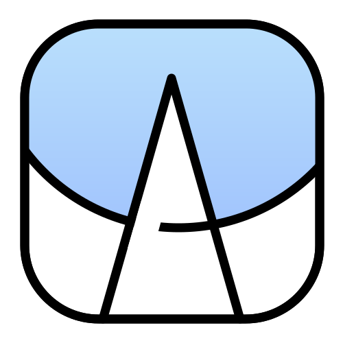

# Anime Helper

</img>


一个追番&自动下载工具，如需在本地搭建，务必先阅读[部署](#部署)

这个项目由ElysiaJS和Vue开发

前端页面的仓库[在这里](https://github.com/Zhoucheng133/Anime-Helper-UI)

## 目录
- [截图](#截图)
- [部署](#部署)
  - [基础服务](#基础服务)
  - [下载器配置](#下载器配置)
- [更新日志](#更新日志)

## 截图


## 部署

### 基础服务

本项目需要使用Docker进行配置

1. 前往Release页面下载docker文件（压缩包）
2. 解压并复制到你的服务器上
3. 使用命令生成镜像`sudo docker build -t helper <文件夹目录>`
4. 使用下面的命令生成容器

```bash
sudo docker run -d \
--restart always \
-p <主机端口>:8080 \
-v <主机上存储数据库的位置>:/app/db \
--name helper helper
```

### 下载器配置

#### 在Docker上部署Aria服务

你需要在搭建设备局域网内（或者就在该设备上）有Aria2服务，详细你可以[查看这里](https://github.com/P3TERX/Aria2-Pro-Docker)。如果你通过该文档安装了Aria2，那么默认的Aria2地址为`http://<ip>:16800/jsonrpc`，密码在你通过Docker安装的时候作为参数写入

#### 使用Motrix下载器 (不推荐)
你也可以通过[Motrix](https://motrix.app/zh-CN)作为Aria下载器，其下载端口和密码在该软件的设置中

## 一些API

[Bangumi API](https://bangumi.github.io/api/)

[Mikan RSS](https://mikanime.tv/RSS/Classic)