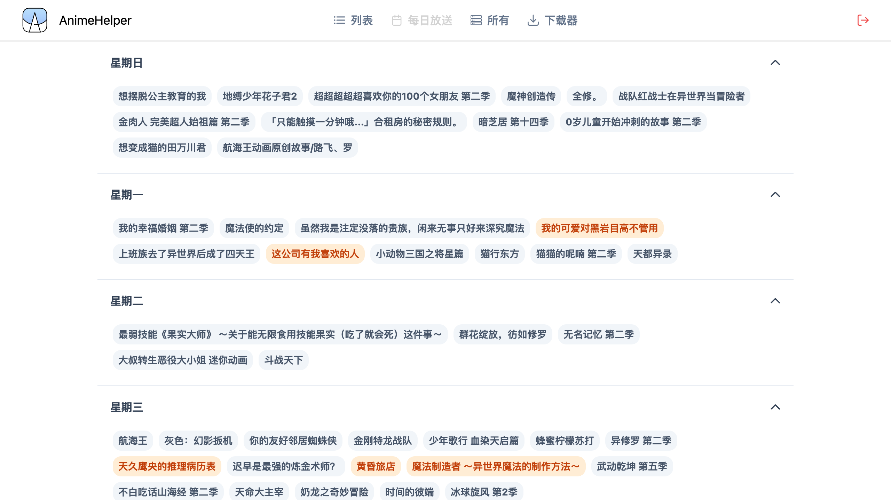
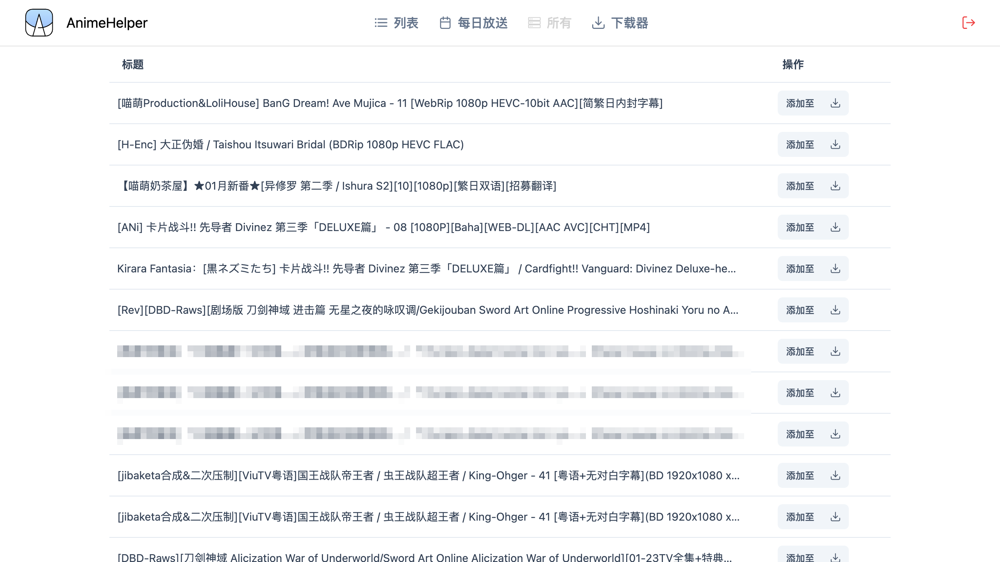

# Anime Helper

</img>


一个追番&自动下载工具，如需在本地搭建，务必先阅读[部署](#部署)

这个项目由ElysiaJS和Vue开发

前端页面的仓库[在这里](https://github.com/Zhoucheng133/Anime-Helper-UI)

## 目录
- [截图](#截图)
- [部署](#部署)
  - [基础服务](#基础服务)
  - [下载器配置](#下载器配置)
- [更新日志](#更新日志)

## 截图






## 部署

### 基础服务

本项目需要使用Docker进行配置

1. 前往Release页面下载docker文件（压缩包）
2. 解压并复制到你的服务器上
3. 使用命令生成镜像`sudo docker build -t helper <文件夹目录>`
4. 使用下面的命令生成容器

```bash
sudo docker run -d \
--restart always \
-p <主机端口>:8080 \
-v <主机上存储数据库的位置>:/app/db \
--name helper helper
```

### 下载器配置

#### 在Docker上部署Aria服务

你需要在搭建设备局域网内（或者就在该设备上）有Aria2服务，详细你可以[查看这里](https://github.com/P3TERX/Aria2-Pro-Docker)。如果你通过该文档安装了Aria2，那么默认的Aria2地址为`http://<ip>:16800/jsonrpc`，密码在你通过Docker安装的时候作为参数写入

#### 使用Motrix下载器 (不推荐)
你也可以通过[Motrix](https://motrix.app/zh-CN)作为Aria下载器，其下载端口和密码在该软件的设置中

## 更新日志

### 3.0.2 (2025/3/16)
- 修复一个列表数据库算法错误

<details>
<summary>过去的版本</summary>

### 3.0.1 (2025/3/16)
- 修复排除关键字不生效的问题

### 3.0.0 (2025/3/14)
- 使用Vue重构前端
- 将用户数据、列表和下载器配置项统一存储到SQLite
- 改进列表获取逻辑，大幅提高性能
- 改进日志显示

### 2.3.0 (2025/1/31)
- 分离前后端
- 使用sqlite存储列表信息
- 大幅提高运行速度

### 2.2.4 (2025/1/14)
- 修复无法通过更新周筛选的问题

### 2.2.3 (2025/1/2)
- 添加在运行时修改表单

### 2.2.2 (2024/12/1)
- 添加输入框回车操作
- 修复logo显示问题

### 2.2.1 (2024/11/29)
- 修复一个字体问题

### 2.2.0 (2024/11/29)
- 添加列表页的分页器
- 添加查看最新的番剧
- 添加从所有页添加到下载器


### 2.1.0 (2024/11/22)
- 添加从更新周筛选列表

### 2.0.2 (2024/11/8)
- 修复一个添加/编辑的问题

### 2.0.1 (2024/10/30)
- 修复请求每日放送项参数错误的问题
- 修复列表项集数范围问题
- 增强安全性

### 2.0.0 (2024/10/30)
- 使用Nextjs重构

### 1.1.0 (2024/10/7)
- 页面使用Nuxt重构
- 添加更多筛选列表的方式
- 添加从每日更新中自动填充总集数和更新集数

### 1.0.3 (2024/9/18)
- 添加每日放送中已存在的提示
- 添加每日放送中显示列表中的项

### 1.0.2 (2024/9/14)
- 修复日志长度无限制的问题

### 1.0.1 (2024/9/12)
- 切换到bgm官方api
- 精简了一些代码


### 1.0.0 (2024/9/11)
- 第一个版本

</details>

## 一些API

[Bangumi API](https://bangumi.github.io/api/)

[Mikan RSS](https://mikanime.tv/RSS/Classic)